# Walking Robot Leg, Diploma Thesis

Ioanna Texakalidou, Integrated Master's thesis, International Hellenic University, 2026

The goal was a robot leg that walks like a real dog. I started from motion capture data of a Dobermann walking (31 frames, one full gait cycle) and asked a simple question: which way of driving the joints reproduces that motion best, and can it actually be built?

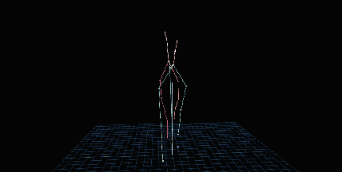

## Four ways to drive the same leg

I compared four methods by how far the toe drifts from the real dog's toe path (RMSE):

| Method | Toe path RMSE | Decision |
|---|---|---|
| Circular gears (fixed ratios) | 44.76 mm | rejected, fixed ratios can't follow a non-linear gait |
| Non-circular gears | 12.34 mm | rejected, the ratio changes sign and the gear shapes become impractical |
| Fourier cam-follower | 2.85 mm (93.6% better than circular gears) | very accurate but needs a complex set of cams |
| Servo control | 2.40 mm | selected |

2.40 mm is the lowest error the 2-D model can reach, because the real motion is 3-D and the model projects it onto one plane. So the servo version is as accurate as this model allows, and it is the simplest to build.

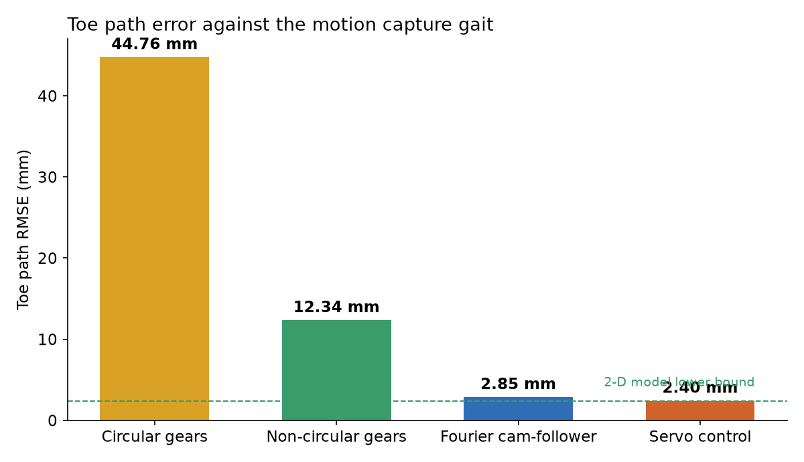

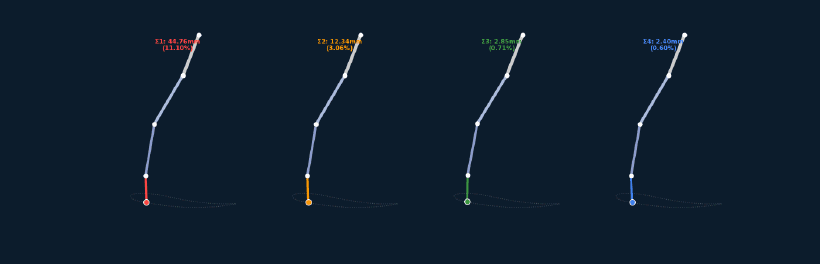

## Loads and actuator sizing

I fitted each joint angle with a 4-harmonic Fourier series (R² above 0.998) and calculated the joint torques with forward kinematics and Newton-Euler dynamics, for a 5.846 kg robot carrying 14.34 N per leg. The shoulder takes almost all the load: 1.355 Nm peak in stance. With a safety factor of 2.0, the shoulder actuator needs a rating of 2.71 Nm.

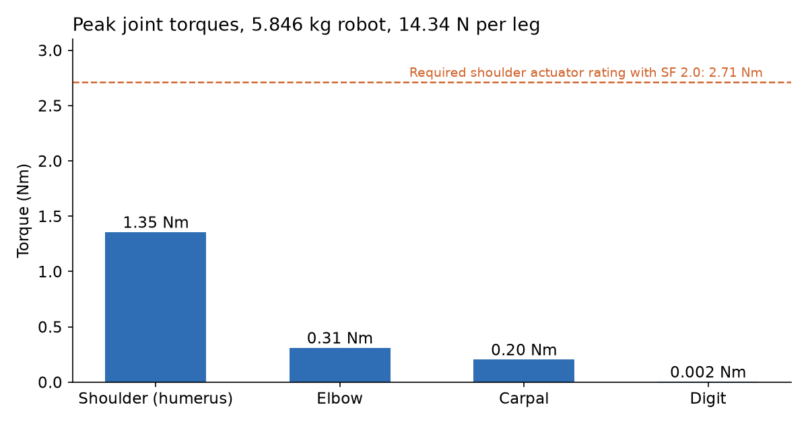

## Design and prototype

I designed both versions in Fusion 360. The gear and belt leg was 3D printed in PLA and assembled with GT2 belts. The servo leg uses an independent servo for each joint, with the Fourier profiles running on an Arduino.

| Gear and belt leg (CAD) | Gear train | Servo leg (CAD) | Servo joint detail |
|---|---|---|---|
| 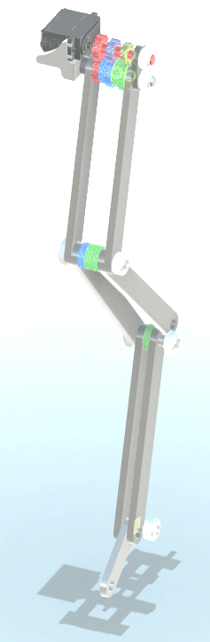 | 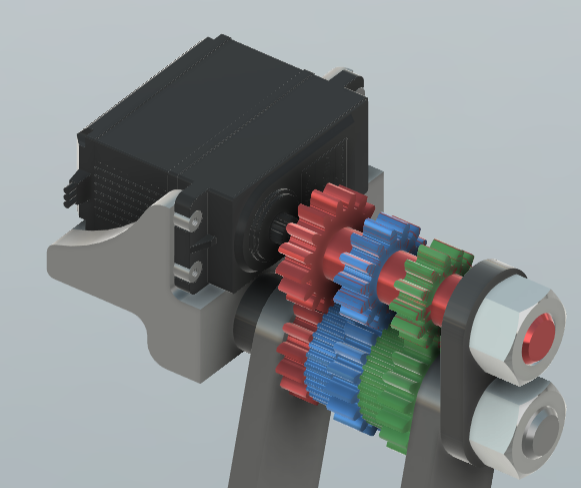 | 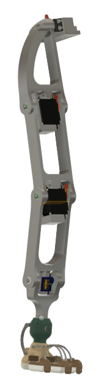 | 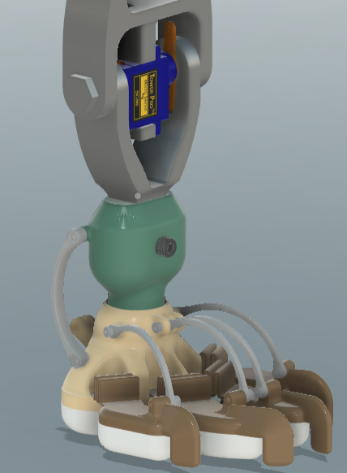 |

| Printed parts | Gear stage | Assembled prototype leg | Arduino test setup |
|---|---|---|---|
| 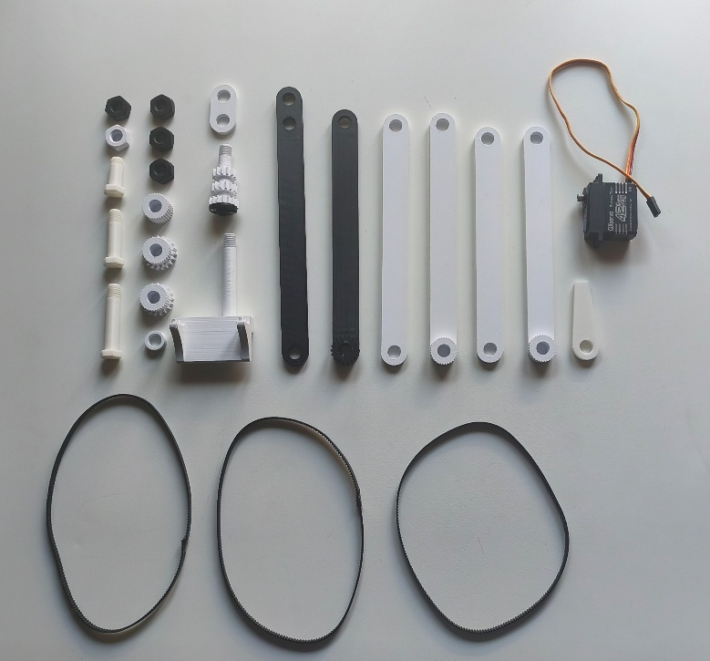 | 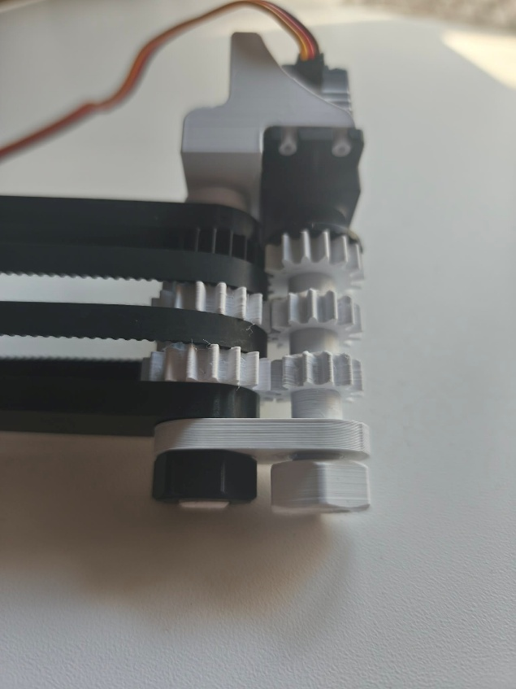 | 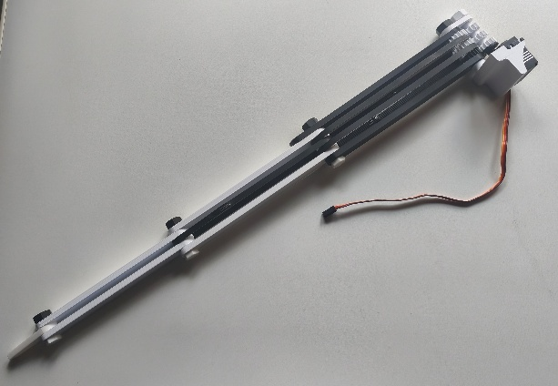 | 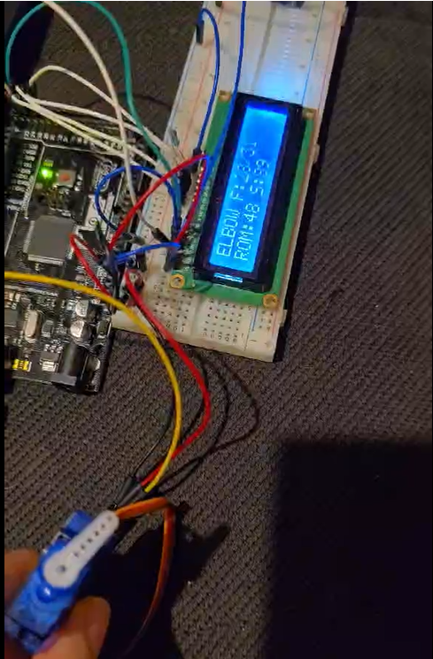 |

## What went wrong and what's next

Servo splines stripped in PETG and Nylon, low infill parts fractured, and a stapled GT2 belt slipped and then snapped. The servo leg is designed but not built yet. Next I want to build it and measure the real toe path error, then move to four legs with an IMU and ground reaction sensors, and a 3-D model.

The model is 2-D, assumes ideal joints and uses one walking gait sample.

## Tools

Python (NumPy, SciPy, Matplotlib), Fusion 360, Arduino (C++), 3D printing

The code and the full thesis are not public. I'm happy to go through it on a call.

Contact: j.texakalidou@gmail.com | [Portfolio](https://ioannatexakalidou.github.io)
